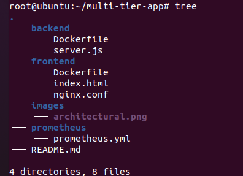

🚀 Secure Multi-Tier Web Application with Monitoring

📌 Project Description

This project demonstrates a secure Multi-Tier Web Application Architecture built using Docker containers and isolated Docker bridge networks.q

The application follows a classic 3-Tier Architecture:

🔹 Frontend Layer – Nginx serving a static web UI

🔹Backend Layer – Node.js + Express REST API

🔹️ Database Layer – MongoDB

Additionally, the project integrates Monitoring & Observability using:

🔹Prometheus – Metrics collection

🔹 Grafana – Metrics visualization dashboard

The primary focus of this project is:

🔹 Network isolation

🔹Secure container communication

🔹 Real-time monitoring of backend metrics

🌐 Docker Networks Used

| Network Name        | Connected Containers                | Purpose                          |
|---------------------|------------------------------------|----------------------------------|
| frontend-network    | UI ↔ API                           | Public access & API routing      |
| backend-network     | API ↔ Database                     | Secure DB communication          |
| monitoring-network  | API ↔ Prometheus ↔ Grafana         | Metrics & monitoring             |

 🏗 Architecture Overview

            🌍 Internet
                  │
                  ▼
     ┌─────────────────────────┐
     │  Frontend (Nginx)       │
     │  [frontend-network]     │
     └─────────────────────────┘
                  │
                  ▼
     ┌─────────────────────────┐
     │  Backend (Node.js)      │
     │  [backend-network]      │
     └─────────────────────────┘
                  │
                  ▼
     ┌─────────────────────────┐
     │  Database (MongoDB)     │
     └─────────────────────────┘

Monitoring Layer:
Backend → Prometheus → Grafana Dashboard

Architecture Diagram

🔐 Security Design

🔹 MongoDB is completely private (no exposed ports)

🔹 Backend is not directly exposed to the internet

🔹 Only frontend exposes port 80

🔹 Separate Docker networks enforce strict access rules

🔹 Backend acts as the only communication bridge

🔹 Monitoring runs in isolated monitoring network

📊 Monitoring Stack

🔹 Prometheus

Collects application metrics

Scrapes backend metrics endpoint

Runs on port 9090

Access:

http://localhost:9090

🔹 Grafana

Visualizes Prometheus metrics

Runs on port 3000 Access:

http://localhost:3000

Example metric used:

process_cpu_user_seconds_total

When messages are saved from frontend, CPU metrics change and can be visualized in Grafana.

⚙️ Tech Stack

🐳 Docker

🌉 Docker Bridge Networks

🌐 Nginx

⚡ Node.js

🚀 Express.js

🗄️ MongoDB

📊 Prometheus

📈 Grafana

📁 Project Structure

🚀 How to Run This Project

🔹 Step 1: Create Networks 

docker network create frontend-network 

docker network create backend-network 

docker network create monitoring-network

🔹Step 2: Run MongoDB 
docker run -d
--name db
--network backend-network
mongo:latest

🔹Step 3: Build & Run Backend 
cd backend 
docker build -t backend-app .

docker run -d
--name api
--network backend-network
backend-app

Connect API to other networks:

docker network connect frontend-network api 
docker network connect monitoring-network api

🔹 Step 4: Build & Run Frontend 
cd ../frontend 
docker build -t frontend-app .

docker run -d
--name ui
--network frontend-network
-p 80:80
frontend-app

🔹Step 5: Run Prometheus

docker run -d \
  --name prometheus \
  --network monitoring-network \
  -p 9090:9090 \
  -v ~/multi-tier-app/prometheus/prometheus.yml:/etc/prometheus/prometheus.yml \
  prom/prometheus

🔹 Step 6: Run Grafana 

docker run -d
--name grafana
--network monitoring-network
-p 3000:3000
grafana/grafana

📚 Key Learnings

🔹Secure container networking

🔹 Multi-network Docker architecture

🔹 Monitoring backend metrics using Prometheus

🔹 Visualizing metrics in Grafana

🔹Production-style containerized architecture

👩‍💻 Author

Uma Pathade

Docker | DevOps |AWS | Terraform |  Linux | Cloud Enthusiast

⭐ If you found this project helpful, consider starring the repository!
